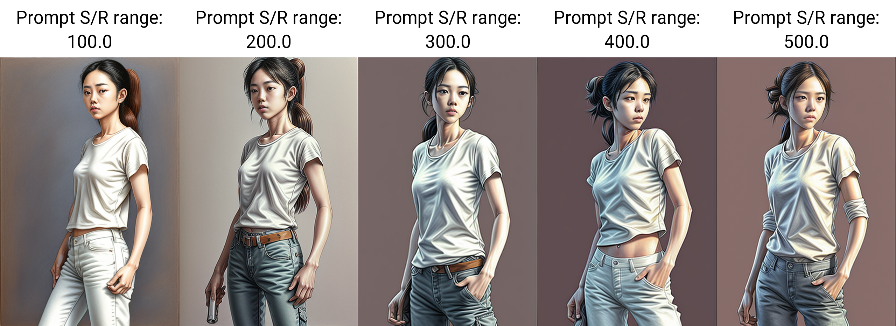

# 这是一个不靠谱的开发用repo | Experimental development Repository
这里是开发用repo，请不要直接克隆使用。安装使用方法在页面下方。X/Y/Z Plot的改动是我在午间凑合来的简单实现，如果对该功能有大量需求，我会完善代码并尝试开PR合并回主分支。使用中有任何问题请及时反馈以便我改进，谢谢！

This is a development repository, deploying it locally is not advised. The changes I made to X/Y/Z plot script was scrapped together during lunch break, I'll refine the implementation and open a PR (hopefully a1111 will be around to approve then) if people find this feature useful. Please open issues if you have any trouble using it, thanks!

## Features
在X/Y/Z Plot脚本的提示词查找替换功能中，增加了指定整数、小数范围的功能。 Added range support for Prompt S/R in X/Y/Z plot script when applying against integer and float numbers.

该功能允许在提示词查找替换功能的基础上使用整数或小数的范围写法。在测试lora、权重等场景下不需要再将所有替换值一一列出了。

- 简单范围：
    - `1-5 = 1, 2, 3, 4, 5`
- 用圆括号指定步长：
    - `1-5 (+2) = 1, 3, 5`
    - `10-5 (-3) = 10, 7`
    - `1-3 (+0.5) = 1, 1.5, 2, 2.5, 3`
- 用方括号指定采样数量
    - `1-10 [5] = 1, 3, 5, 7, 10`
    - `0.0-1.0 [6] = 0.0, 0.2, 0.4, 0.6, 0.8, 1.0`

比如，在X/Y/Z Plot脚本下拉菜单中选中`Prompt S/R Range`并输入`100-500 (+100)`，对于提示词`full body of a woman in white t-shirt and tight jeans, hands in pocket, model shot poses, in the style of pencil-draw-100` 将生成如下结果


## 安装方法 | Installation
### X/Y/Z Plot
- 打开本页面`scripts`目录下的`xyz_grid.py`文件，或者点击[此链接](https://raw.githubusercontent.com/AI-skimos/stable-diffusion-webui/master/scripts/xyz_grid.py)，将代码内容拷贝并替换你的webui本地目录中的相应文件即可。Open `xyz_grid.py` under `scripts` directory from this repo, and replace your local file with its content.
- 熟练git使用方法的用户可增加本repo为新的remote并checkout。Alternatively, add this repo as a new remote and checkout.
#### 回滚 | Reset
- 目前改动并没有合并，你在下次尝试升级`automatic1111 webui`时会报冲突错误。如果你并不想继续使用本功能了，请在你本地的webui安装目录运行以下命令。You'll most likely get conflicts the next time your try to update your `automatic1111 webui` because of the unmerged changes. If you don't want to use this custom feature anymore, please run the following command line in your local installation folder. 
```bash
git reset --hard
```
## 已知问题 | Known Issue
- 当提示词中有多个查找结果时，会同时替换所有满足查找条件的文本。这并不是本改动造成的，请确保提示词中只有一处查找结果。In case of multiple hits, all instances will be replaced. This is not an issue introduced by this custom feature. Please make sure there's only one hit for the searching criteria in your prompt.
- 目前仅支持整数、小数的查找替换。比如0001-0003会被解析为1-3。Currently only integers and floats are supported, e.g. 0001-0003 will be parsed as 1-3. 

## Credit
Thanks to `Florency(罐罐罐罐罐)` for the idea.

Illustration credit to `codelsy`'s colored pencil drawing dataset.
